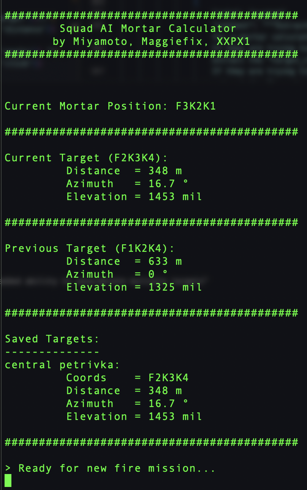

# Squad AI Assistant aka JARVIS

## a completely hands free, voice activated AI assistant for mortar calculations and other custom AI commands to be used in Squad - a modern military simulation PC game by OWI.

_<small>Be advised, this project is still under development. This has ONLY been tested on MacOS, and not on Windows. This project is also not affiliated in any way with OWI (offworld industries) or any other companies.</small>_

_<small>This is a personal project by Miyamoto (in-game name) and often used on the 7th Gothic server if you want to join and see it in action!</small>_

**Please report issues here on Github if you run into any bugs!**

## Core Features

- Quickly calculate fire missions with coordinates using just your voice
- Fire Mission Manager: Save current target with a custom name to view in a list of available targets. Uses AI to efficiently and easily manage a list of targets.
- TTS (text to speech): Announces elevation, azimut and other useful information upon calculating a fire mission or executing a custom command.
- VAD (voice activity detection): Detects when you're done talking and then processes your commands accordingly.
- Wake word detection: Activate your AI assistant by saying "Jarvis" or any other compatible wake word (check out the README for more details)

## How to use

This is a Python script that uses Picovoice, OpenAI Whisper and GPT-4o structured outputs to start listening/activate commands upon stating 'Jarvis' (or any compatible hotword), transcribe your voice and convert it into specific commands for a mortar calculator / generalized AI assistant for Squad.

Just say something like,"Hey Jarvis, set mortar position to foxtrot 3 2 1 4" or "Jarvis, fire mission at indigo 11 1 3 6" and the script will set the mortar position or fire mission respectively.

Infinite subsets are possible like A1K2K5K7K9K8 but you do not have to subset either, A1K7 is totally fine!

Available commands:

- "Setup mortar position at foxtrot 3 2 1 4" to set the mortar position
- "New fire mission at F2 3 4" to set a mortar target with coordinates F2K3K4
- "Save current target as Airfield" to save the current target with a custom name
- "Delete Airfield target" to delete the Airfield target
- "Delete all targets except Airfield" to delete all targets except for Airfield

More commands coming soon!

## How to install

1. Setup poetry on your computer. More on that [here](https://python-poetry.org/docs/)
2. Install dependencies with `poetry install`
3. Set environment variables for OpenAI and Porcupine
4. Install sox and ffmpeg to your computer via brew install if you're on mac, or download from the website if you're on windows
   (used for voice activity detection. disable VAD if you can't install sox and ffmpeg)
5. Run the script with `poetry run python src/main.py`

## How to setup the environment variables

1. Create a `.env` file in the root directory
2. Copy the content of `.env.example` into the `.env` file
3. Set the env variables to your own API keys from OpenAI & Porcupine

Porcupine is a wake word detection engine. You can get your Porcupine API key [here](https://picovoice.ai/platform/porcupine/).

OpenAI is a large language model provider used to transcribe your voice to text and convert the text input into specific commands using JSON structured outputs. You can get your OpenAI API key [here](https://platform.openai.com/).

## How to enable, disable and configure features

- To enable/disable voice activity detection, change the `USE_VAD` variable in `src/main.py` to `True` or `False`
  (by disabling VAD, the script will always listen for 5 seconds and then process the audio)

- To enable/disable wake word detection, change the `USE_WAKE_WORD` variable in `src/main.py` to `True` or `False`
  (by disabling wake word detection, you will need to press enter to start a voice command)

- Set a different wake word by changing the `WAKE_WORD` variable in `src/main.py` to any of the following available wake words:
  grapefruit, alexa, ok google, picovoice, americano, computer, hey barista, hey siri, porcupine, hey google, blueberry, terminator, jarvis, pico clock, bumblebee, grasshopper (check out the [Picovoice Docs](https://picovoice.ai/docs/porcupine/) to learn how to train your own custom wake words)

## Future improvements

- [ ] Option to run whisper locally instead of using the API
- [x] Integrate TTS so the AI can talk back to the user and announce elevation/azimuth
- [x] Instead of recording for 5 seconds, use VAD (voice activity detection) to detect when you're done talking and then process the audio
- [x] Display previous elevation/azimuth values so it's easier to switch between two targets
- [x] Allow users to save targets to a list
- [x] Allow users to delete saved targets or delete all saved targets at once
- [x] Allow users to disable hotword detection and just use the onboard microphone on click of a keyboard button while also allowing them to enter in coordinates manually
